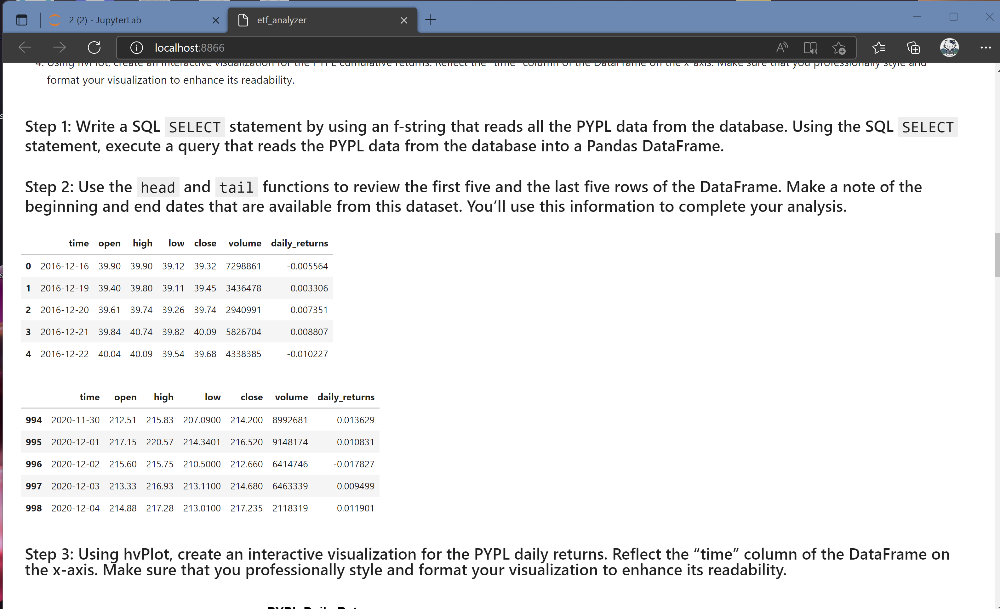
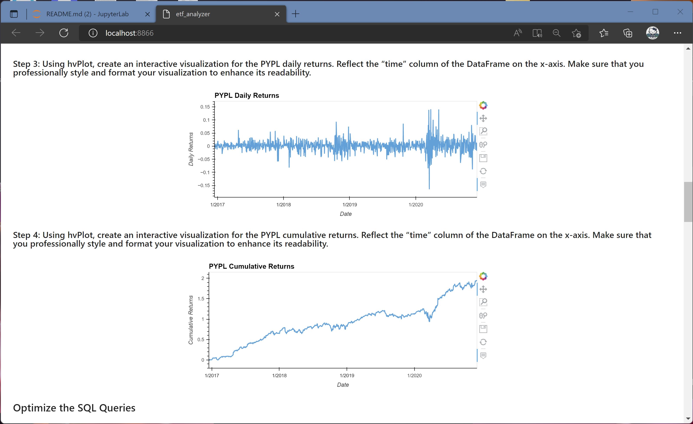
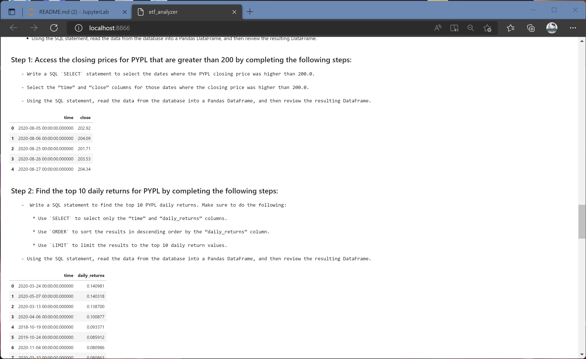
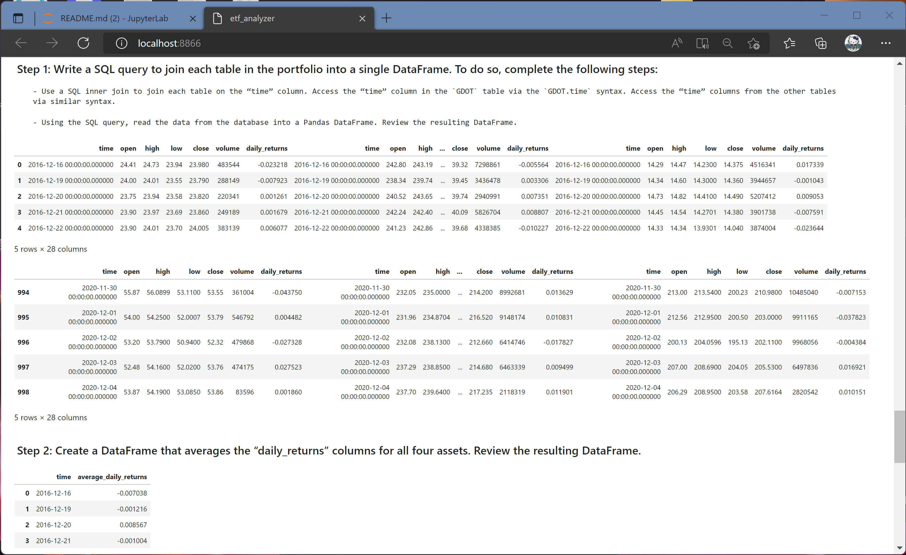
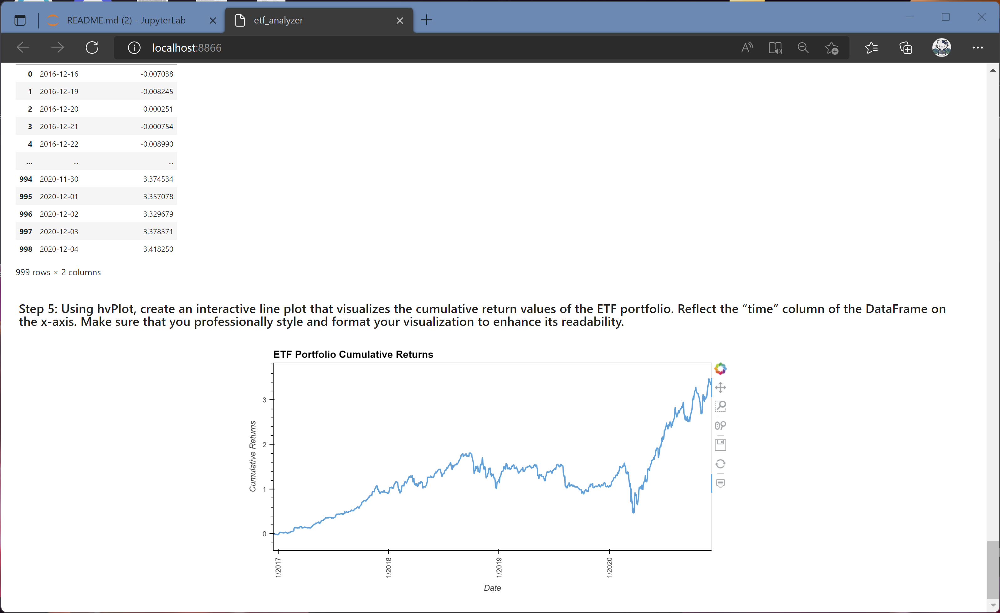

# M7_ETFAnalyzer

In this project, I built a financial database and web application by using SQL, Python, and the Voilà library to analyze the performance of a hypothetical fintech ETF. I used this notebook to complete my analysis of a fintech ETF that consists of four stocks: GOST, GS, PYPL, and SQ. Each stock has its own table in the etf.db database. I analyzed the daily returns of the ETF stocks both individually and as a whole. Then, I deployed the visualizations to a web application by using the Voilà library.

## STEP ONE - Import and Create

Imports the required libraries, initiates the SQLite database, popluates the database with records from the etf.db seed file that, creates the database engine, and confirms that data tables it now contains.

## STEP TWO - Analyze a single asset in the FinTech ETF

Uses SQL queries with Python, Pandas, and hvPlot to analyze the performance of a single asset from the ETF.

## STEP THREE - Optimize the SQL Queries

Continues to analyze a single asset (PYPL) from the ETF. Use advanced SQL queries to optimize the efficiency of accessing data from the database.

## STEP FOUR - Analyze the Fintech ETF Portfolio

Builds the entire ETF portfolio and then evaluates its performance. To do so, builds the ETF portfolio by using SQL joins to combine all the data for each asset.

## STEP FIVE - Deploy the Notebook as a Web Application

Use the Voilà library to deploy your notebook as a web application.

### Screenshots included:

